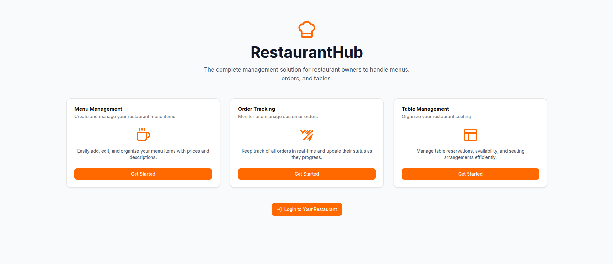
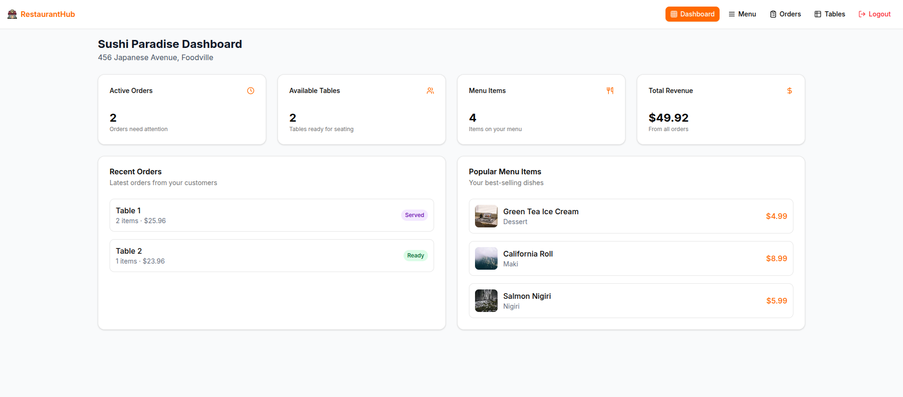
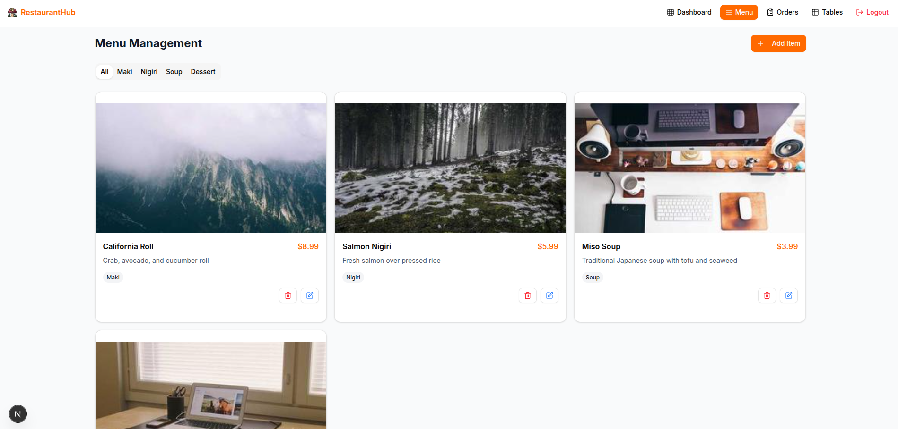
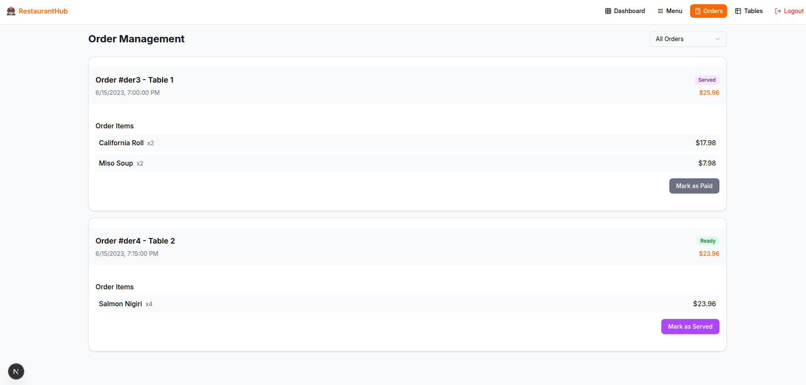
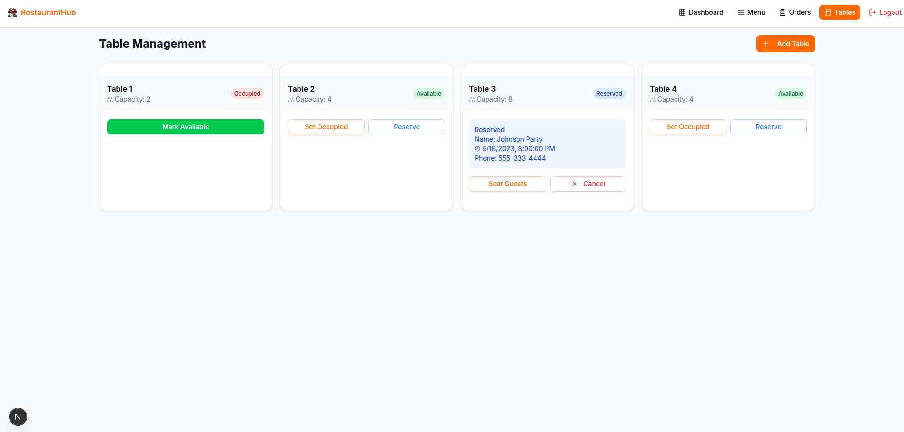

# RestaurantHub - Restaurant Management System

RestaurantHub is a comprehensive restaurant management system designed to help restaurant owners efficiently manage their menus, orders, and tables. This frontend application provides a user-friendly interface for restaurant management tasks.

## Tech Stack

- **Framework**: Next.js 14+ (App Router)
- **Language**: TypeScript
- **Styling**: Tailwind CSS
- **UI Components**: shadcn/ui
- **Form Handling**: React Hook Form
- **State Management**: React Context API
- **Data Storage**: Mock data with localStorage persistence
- **Icons**: Lucide React

## Features

- **Authentication System**

  - Login with restaurant code and credentials
  - Session persistence with localStorage

- **Dashboard**

  - Overview of restaurant performance
  - Key metrics and statistics
  - Recent orders and popular menu items

- **Menu Management**

  - Create, edit, and delete menu items
  - Categorize menu items
  - Set prices and descriptions
  - Add images to menu items
  - Random image generation

- **Order Management**

  - Track order status (pending, preparing, ready, served, paid)
  - View order details
  - Update order status
  - Filter orders by status

- **Table Management**

  - Add and manage tables
  - Track table status (available, occupied, reserved)
  - Make and manage reservations
  - View table capacity

- **Theme Support**
  - Toggle between light and dark mode
  - Theme persistence with localStorage
  - System preference detection

## Installation & Setup

1. **Clone the repository**
   \`\`\`bash
   git clone https://github.com/aayuss51/nextjs-restro.git
   cd restaurant-hub
   \`\`\`

2. **Install dependencies**
   \`\`\`bash
   npm install

   # or

   yarn install

   # or

   pnpm install
   \`\`\`

3. **Run the development server**
   \`\`\`bash
   npm run dev

   # or

   yarn dev

   # or

   pnpm dev
   \`\`\`

4. **Open your browser**
   Navigate to [http://localhost:3000](http://localhost:3000) to see the application.

## Usage

1. **Login to the system**

   - Use one of the demo accounts provided below
   - Enter the restaurant code, email, and password

2. **Navigate the dashboard**

   - View key metrics and recent activity
   - Access different management sections

3. **Manage your menu**

   - Add new menu items with descriptions and prices
   - Categorize items for easy navigation
   - Update or remove existing items

4. **Track and update orders**

   - View incoming orders
   - Update order status as they progress
   - Filter orders by status

5. **Manage tables and reservations**

   - Add tables with capacity information
   - Make reservations for customers
   - Update table status

6. **Toggle theme**
   - Use the sun/moon icon in the navigation bar to switch between light and dark mode

## Demo Credentials

The application comes with two demo restaurant accounts:

1. **Italian Restaurant**

   - Restaurant Code: `ITALIA123`
   - Email: `italian@example.com`
   - Password: `password123`

2. **Sushi Restaurant**
   - Restaurant Code: `SUSHI456`
   - Email: `sushi@example.com`
   - Password: `password123`

## Assumptions

1. **Frontend-Only Application**

   - This is a frontend-only application with no backend server
   - All data is stored in mock data structures and persisted in localStorage
   - In a production environment, this would connect to a real database

2. **Authentication**

   - Authentication is simulated using localStorage
   - In a production environment, this would use proper authentication mechanisms like JWT

3. **Restaurant Code**

   - Each restaurant has a unique code that must be entered during login
   - This simulates a multi-tenant application where different restaurants have their own data

4. **Images**

   - Menu item images are from Lorem Picsum (random image service)
   - In a production environment, this would use real image uploads and storage

5. **Data Persistence**

   - Changes made to the data (adding menu items, updating orders, etc.) persist only during the session
   - Data is reset when the page is refreshed (except for authentication state)

6. **Responsive Design**
   - The application is designed to work on both desktop and mobile devices
   - Some features may have a different layout on smaller screens

## Approximate Time Taken

1 hour and 45 minutes

## Acknowledgements

- [Next.js](https://nextjs.org/)
- [Tailwind CSS](https://tailwindcss.com/)
- [shadcn/ui](https://ui.shadcn.com/)
- [Lucide Icons](https://lucide.dev/)
- [Lorem Picsum](https://picsum.photos/)
